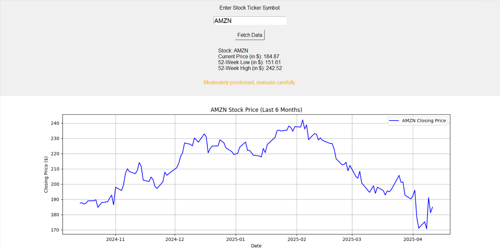
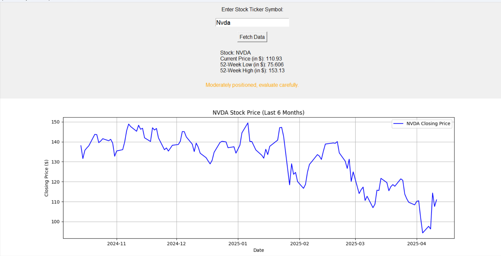

# **Stock Analysis**  

A user-friendly application that provides real-time stock data, investment suggestions, and visualizes stock trends to help users make informed decisions.  

## **Features**  
- **Real-Time Stock Data**: Displays current price, 52-week high, and 52-week low for any stock.  
- **Investment Suggestions**: Recommends long- or short-term strategies based on stock performance.  
- **Trend Visualization**: Plots a 6-month price trend graph for easy analysis.  

## **How It Works**  
1. Enter the stock ticker (e.g., `AAPL` for Apple or `AMZN` for Amazon).  
2. Fetch real-time data and visualize trends with a single click.  
3. Get actionable insights with suggestions tailored to stock performance.  

## **Technologies Used**  
- **Libraries**: yfinance, Matplotlib, Tkinter.  

## Features

- Real-time stock info (current price, 52-week high & low)  
- 6-month trend graph for any stock  
- Smart investment recommendations  
- Minimalist Tkinter GUI  
- Lightweight and fast

---

## Live Demo

### 🔹 AMZN Stock Analysis  


---

### 🔹 NVDA Stock Analysis  


---

## 🛠️ Built With

- **Python 3.x**
- [yfinance](https://pypi.org/project/yfinance/)
- [Matplotlib](https://matplotlib.org/)
- Tkinter (Standard Python GUI)

---

## ⚙️ How to Use

1. Clone the repository:
   ```bash
   git clone https://github.com/Shiv-61/Stock_analysis.git
   cd Stock_analysis


## **Setup**  
1. Clone the repository:  
   ```bash  
   git clone https://github.com/Shiv-61/Stock_analysis.git  
   ```  

2. Install dependencies:  
   ```bash  
   pip install yfinance matplotlib  
   ```  

3. Run the application:  
   ```bash  
   python stock_analyzer.py  
   ```  
## **License**  
This project is licensed under the MIT License.  
